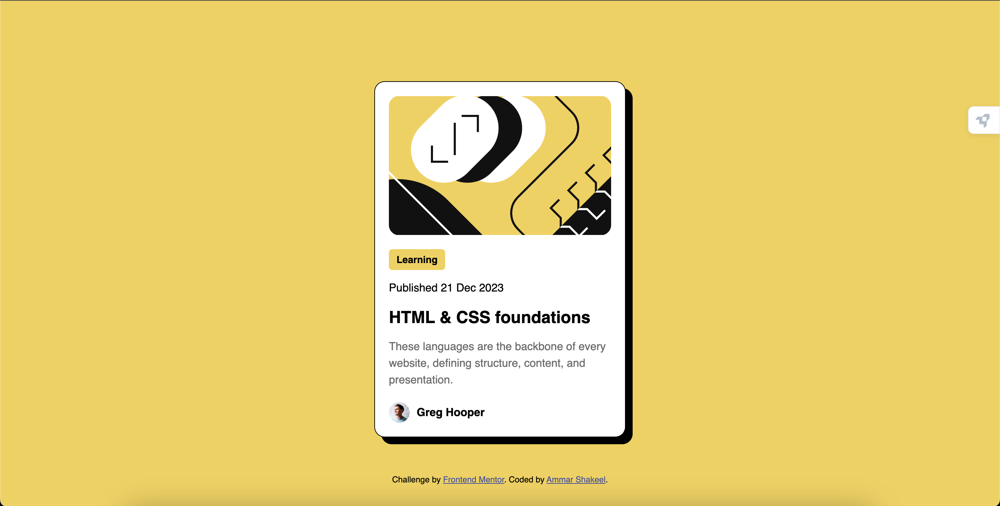

# Frontend Mentor - Blog preview card solution

This is a solution to the [Blog preview card challenge on Frontend Mentor](https://www.frontendmentor.io/challenges/blog-preview-card-ckPaj01IcS). Frontend Mentor challenges help you improve your coding skills by building realistic projects. 

## Table of contents

- [Overview](#overview)
  - [The challenge](#the-challenge)
  - [Screenshot](#screenshot)
  - [Links](#links)
- [My process](#my-process)
  - [Built with](#built-with)
  - [What I learned](#what-i-learned)
  - [Continued development](#continued-development)
  - [Useful resources](#useful-resources)
- [Author](#author)
- [Acknowledgments](#acknowledgments)

## Overview

### The challenge

Users should be able to:

- See hover and focus states for all interactive elements on the page

### Screenshot

### Links

- Solution URL: 
- Live Site URL: [https://ammarshakeel1.github.io/jubilant-spoon/](https://ammarshakeel1.github.io/jubilant-spoon/)

## My process

### Built with

- Semantic HTML5 markup
- CSS custom properties
- Flexbox
- CSS Grid
- Mobile-first workflow

### What I learned

This project helped reinforce my learning about creating and styling websites with HTML and CSS. I learned some stuff about responsive design and 

### Continued development

I have yet to do any development with JavaScript so I am looking forward to get into doing that. Honestly I just want to be able to know the right commands to get a certain thing done and become more familiar with how the layouts work when created in HTML, like I look at it and its just a bunch of text but I wanna be able to just know how it'll come out to just by looking at the text, or something like that idk just becoming more familiar with what I'm looking at.

### Useful resources

- [W3 Schools](https://www.w3schools.com/css/default.asp) - Awesome website, has so many different techniques shown and how to implement them.

## Author

- Website - [Ammar Shakeel](https://www.linkedin.com/in/ammar-shakeel-69436b282/)
- Frontend Mentor - [@ammarshakeel1](https://www.frontendmentor.io/profile/ammarshakeel1)

## Acknowledgments

The internet.